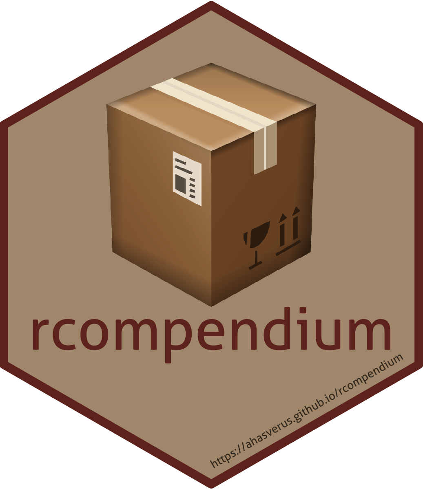

# rcompendium 

<!-- badges: start -->

[](https://CRAN.R-project.org/package=rcompendium/)
[](https://github.com/FRBCesab/rcompendium/actions/workflows/R-CMD-check.yaml)
[](https://github.com/FRBCesab/rcompendium/actions/workflows/pkgdown.yaml)
[](https://app.codecov.io/gh/FRBCesab/rcompendium)
[](https://choosealicense.com/licenses/gpl-2.0/)
<!-- badges: end -->

In the area of open science, making reproducible analyses is a strong
prerequisite. But sometimes it is difficult 1) to find the good
structure to organize files and 2) to set up the whole project. The aim
of the package `rcompendium` is to make easier the creation of R
package/research compendium (i.e. a predefined files/folders structure)
so that users can focus on the code/analysis instead of wasting time
organizing files.

A full ready-to-work structure will be set up with the following
features:

- Initialization of version control with [git](https://git-scm.com/).
- Creation of a minimal R package structure (`DESCRIPTION` and
  `NAMESPACE` files, and `R/` and `man/` folders).
- Creation of additional files (`LICENSE.md`, `inst/CITATION`, etc.).
- Creation of a *Get started* vignette in `vignettes/` (package only).
- Setting the units tests process in `tests/`.
- Creation of a `README.Rmd` with HexSticker (template) and badges.
- Autocompletion of maintainer information.
- Initialization of the `renv` system (if required).
- Creation of a Dockerfile (if required).
- Creation of a GitHub repository.
- Configuration of GitHub Actions to automatically:
  - check and test package (`R CMD Check`);
  - report the code coverage (`covr`);
  - build and deploy website (`pkgdown`);
  - render `README.md`.

This package heavily relies on the R packages
[`devtools`](https://devtools.r-lib.org) and
[`usethis`](https://usethis.r-lib.org) and follows recommendations made
by [Hadley Wickham & Jenny Bryan](https://r-pkgs.org) and [Ben
Marwick](https://peerj.com/preprints/3192/).

## Installation

You can install the stable version from
[CRAN](https://cran.r-project.org/) with:

``` r
## Install stable version of < rcompendium > from CRAN ----
install.packages("rcompendium")
```

Or you can install the development version from
[GitHub](https://github.com/) with:

``` r
## Install < remotes > package (if not already installed) ----
if (!requireNamespace("remotes", quietly = TRUE)) {
  install.packages("remotes")
}

## Install dev version of < rcompendium > from GitHub ----
remotes::install_github("FRBCesab/rcompendium")
```

## Usage

Please read the [Get
started](https://frbcesab.github.io/rcompendium/articles/rcompendium.html)
vignette and pay attention to the sections
[Prerequisites](https://frbcesab.github.io/rcompendium/articles/rcompendium.html#prerequisites)
and
[Usage](https://frbcesab.github.io/rcompendium/articles/rcompendium.html#usage)

Others available vignettes:

- [Developing a
  Package](https://frbcesab.github.io/rcompendium/articles/developing_a_package.html)
- [Working with a
  Compendium](https://frbcesab.github.io/rcompendium/articles/working_with_a_compendium.html)

## Citation

Please cite this package as:

> Casajus N. (2023) rcompendium: An R package to create a package or
> research compendium structure. Version 1.1,
> <https://github.com/FRBCesab/rcompendium>.

You can also run:

``` r
citation("rcompendium")

## A BibTeX entry for LaTeX users is:
## 
## @Manual{,
##   title  = {{rcompendium}: {An} {R} package to create a package or research compendium structure},
##   author = {{Casajus N.}},
##   year   = {2023},
##   note   = {R package version 1.1},
##   url    = {https://github.com/FRBCesab/rcompendium},
## }
```

## Contributing

You are welcome to contribute to the `rcompendium` project. Please read
our [Contribution
Guidelines](https://frbcesab.github.io/rcompendium/CONTRIBUTING.html).

Please note that the `rcompendium` project is released with a
[Contributor Code of
Conduct](https://frbcesab.github.io/rcompendium/CODE_OF_CONDUCT.html).
By contributing to this project, you agree to abide by its terms.

## Colophon

This package is the result of intense discussions and feedback from the
training course [Reproducible Research in Computational
Ecology](https://rdatatoolbox.github.io/).

`rcompendium` is largely inspired by the package
[`rrtools`](https://github.com/benmarwick/rrtools) developed by [Ben
Marwick *et al.*](https://github.com/benmarwick) and tries to respect
the standard defined by the community.
